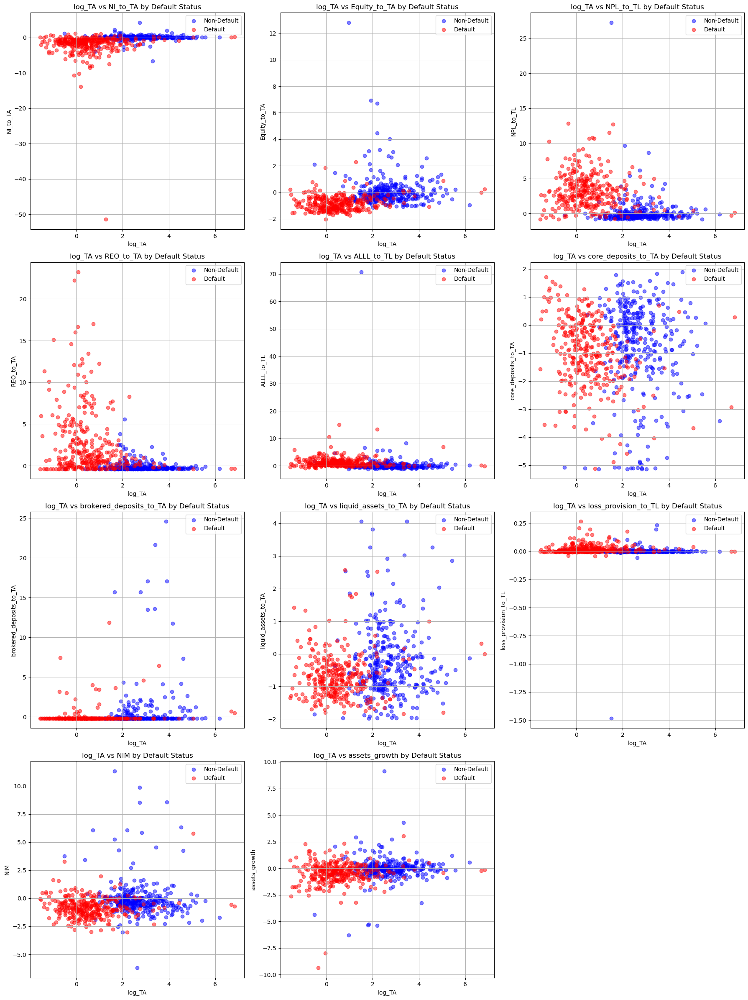
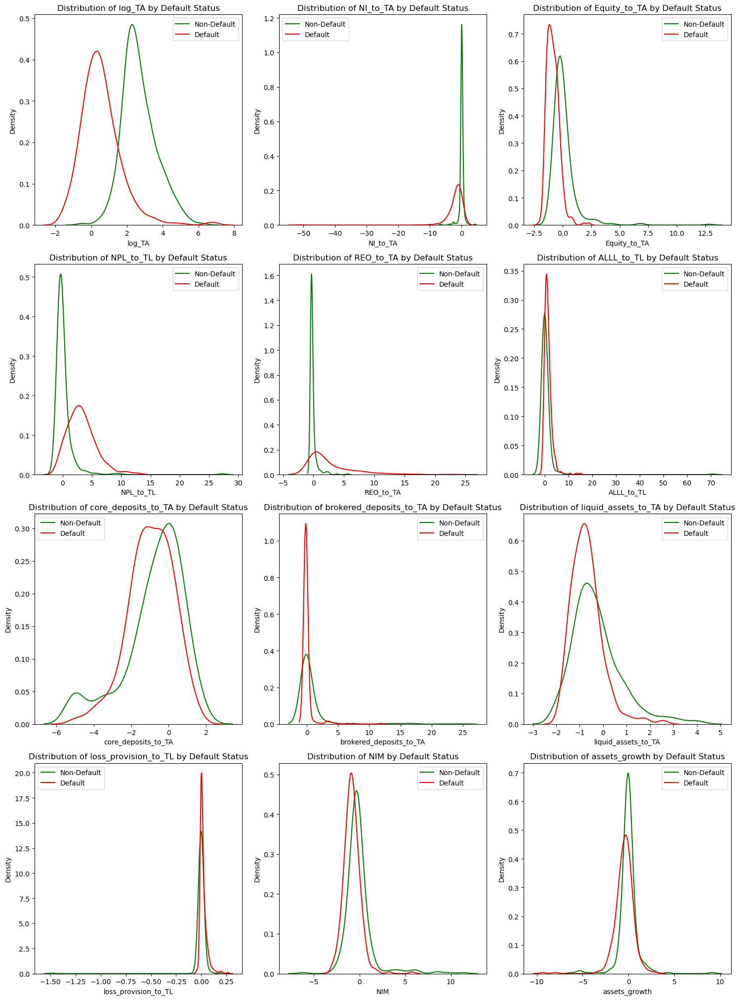
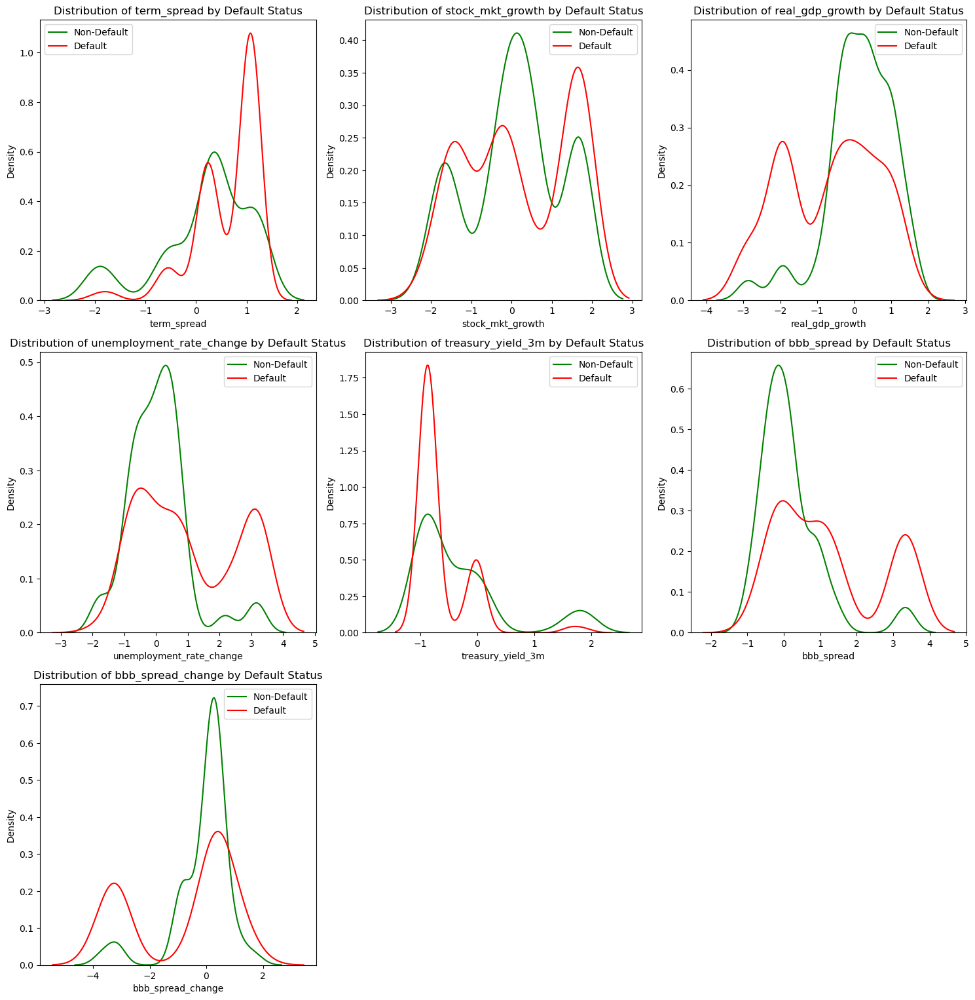
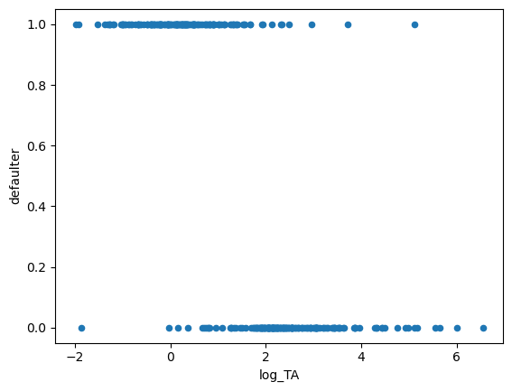
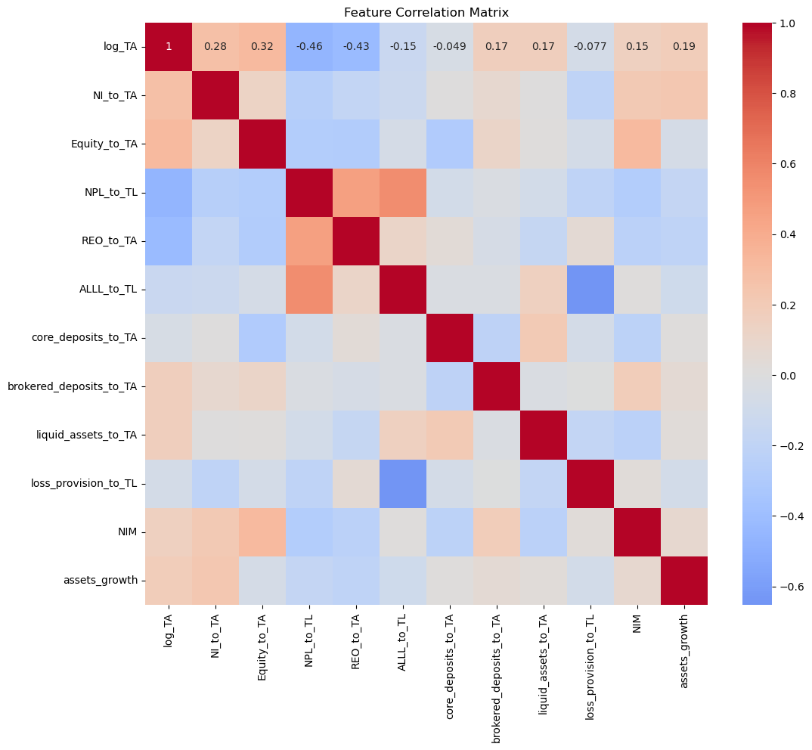
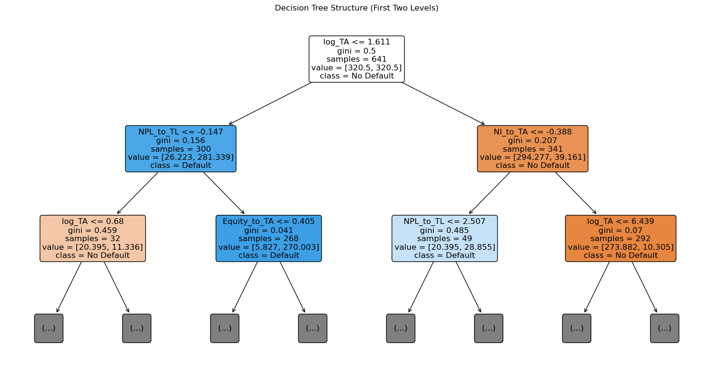
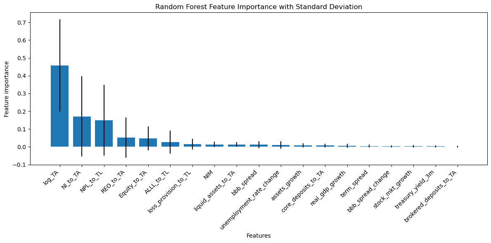
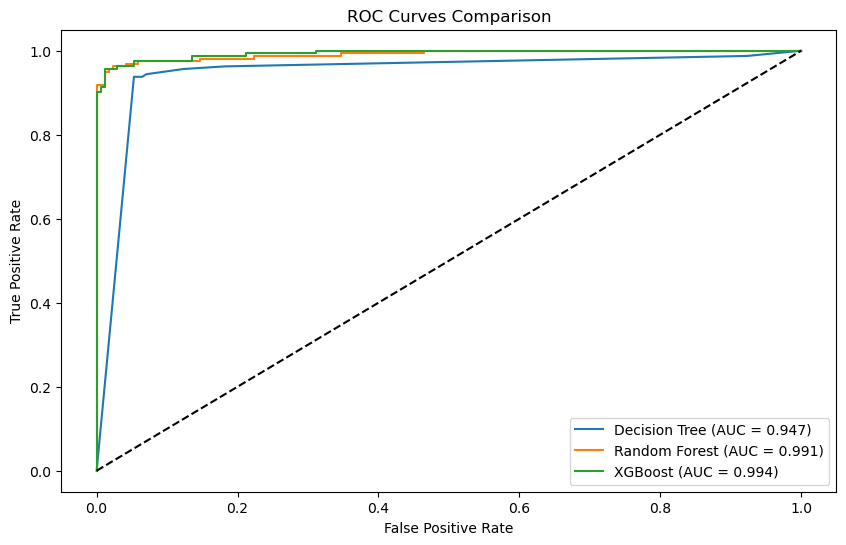

# Project Overview

This project aims to estimate the probability of default for banks using financial ratios derived from FDIC data. By leveraging machine learning techniques like Classification and Regression Trees (CART), we predict bank defaults, a rare event with probabilities around 1%. The project also identifies key financial features by Random Forest Tree algorithm and optimizes the model with Extreme Gradient Boosting to enhance predictive accuracy.

## Table of Contents
1. [Introduction](#introduction) 
2. [Corporate Credit Modeling: The Merton Model](#merton-model)  
3. [Data Acquisition](#data-acquisition)
4. [Exploratory Data Analysis](#eda)
5. [Decision Tree Classification](#decision-tree-classification) 
6. [Random Forests Classification](#random-forests-classification) 
7. [XGBoost Classification](#xgboost-classification) 
8. [Performance And Metrics Report](#performance-and-metrics-report) 

## <a id="introduction"></a> Introduction  

Corporate default occurs when a company fails to fulfill its debt obligations, such as by missing payments or filing for bankruptcy. This project focuses on estimating the probability of default for banks, a challenge closely related to understanding corporate defaults. Both bank failures and corporate defaults involve predicting rare events, with probabilities typically around 1%. These events rely on analyzing financial ratios derived from raw financial data rather than directly using the raw data itself. By examining patterns in these ratios, the goal is to determine the likelihood of a binary outcome—either default or failure.

However, banks and corporations differ fundamentally. Banks, unlike corporations, don't sell physical or digital goods, so Call Reports for banks lack items like the cost of goods sold. Banks also have a more complex debt structure, with a focus on lending and deposits, and their assets are more specialized compared to corporations' non-financial assets.

In this project, we utilize data from the Federal Deposit Insurance Corporation (FDIC) to model the probability of default for banks. By selecting key economic features and financial ratios, we employ machine learning techniques, specifically Classification and Regression Trees (CART), to predict default probabilities. Subsequently, we identify the most influential features within the tree-based model. Finally, we optimize the model using a gradient boosting approach and visualize the resulting insights for a comprehensive understanding of the outcomes.


```python
# Import Required Libraries and Set Up
import pandas as pd
import numpy as np
import math
import matplotlib.pyplot as plt
import seaborn as sns
import xgboost as xgb
from scipy import stats
from sklearn.tree import DecisionTreeClassifier, plot_tree
from sklearn.ensemble import RandomForestClassifier
from sklearn.ensemble import GradientBoostingClassifier
from sklearn.metrics import confusion_matrix, classification_report, roc_auc_score, roc_curve
from sklearn.calibration import calibration_curve

# Suppress warnings for cleaner output
import warnings
warnings.filterwarnings('ignore')  
```

## <a id="merton-model"></a> Corporate Credit Modeling: The Merton Model
The Merton model for corporate default (1974-peresent) is a structural credit model that models the default of a firm as the point at which its asset value falls below a certain debt level. The model assume that the firm's assets follow a geometric Brownian motion and that the firm's equity can be viewed as a call option on its assets.

$$
dV(t) = \mu V(t) dt + \sigma V(t) dW(t)
$$

Where $V(t) $ is the value of the firm's assets at time $ t $. $ \mu $ is the drift of the asset value, representing the expected return of the firm's assets. $ \sigma $ is the volatility of the asset value. $ W(t) $ is a standard Brownian motion.

A firm is run by equity holders. At time $T$, they pay the face value of the debt $D$ if the firm’s asset value is larger than $D$, and keep the remaining amount. If the firm’s value at time $T$ is less than $D$, bondholders take over and recover a "recovery" value $V_T$, while equity holders get nothing.

$$ B_t = min(V_t, D) = D - max (D- V_t, 0)$$
$$ St= max(V_t - D, 0)$$   

For probabilistic Structual model we have :

$$
P(\text{default}) = \mathbb{E}[I_{\{V_T< D\}}] = Pr(V_T< D) =N(-d_2)
$$
which only depends on the Assets/Debt ratio and asset volatility. And where $N(x)$ is the cumulative distribution function (CDF) of the standard normal distribution, and the terms $d_1$ and $d_2$ are defined as:

$$
d_1 = \frac{\ln(V(t)/D) + (\mu + \sigma^2/2)(T-t)}{\sigma \sqrt{T-t}}
$$

$$
d_2 = d_1 - \sigma \sqrt{T-t}
$$

The Merton model is impractical for financial institutions due to their high leverage, complex short-term debt structures, and volatility that spikes during crises, which the model cannot adequately capture. The problem of predicting bank failures is therefore addressed using statistical and machine learning approaches. 

Logistic regression has long been a traditional and well-known method for predicting probabilities, such as assessing the likelihood of bank failure. It operates by modeling the probability of a binary outcome using the logistic function:

$$
P(Y_{t+T} = 1 \mid X_t) = \frac{1}{1 + e^{-\sum W_i X_{it}}}
$$

where $ X_t $ represents financial features, $ W_i $ are the corresponding weights, and the sigmoid function maps the output to probabilities. Logistic regression is flexible, interpretable, and suitable for dynamic financial conditions.

However, a more effective approach for such analyses, especially when dealing with complex, non-linear relationships in financial data, is the CART models. Unlike logistic regression, CART models partition the feature space into regions and assign probabilities or predictions based on these partitions. This makes them better suited for capturing non-linear patterns, interactions, and high-dimensional data.

In general, for probabilistic models, we estimate conditional probabilities based on the input features $ \mathbf{x} $.

For probabilistic regression models, we estimate:  
$$
p(y \mid \mathbf{x}), \; y \in \mathbb{R}
$$

For probabilistic classification models:  
$$
p(y \mid \mathbf{x}), \; y \in \{ C_1, \ldots, C_K \}
$$

Where:  
 $C_1, \ldots, C_K $ represent class labels for $ K $ classes.  Probabilities across all $ K $ classes satisfy:  
  $$
  \sum_{k} p(C_k \mid \mathbf{x}) = 1
  $$

In binary classification (K=2), the target variable $ y $ typically takes values such as $ \{0, 1\} $, or descriptive labels such as (low risk, high risk). In this case, the positive class probability is defined as:  
$$
p(y = 1 \mid \mathbf{x})
$$

And the probability of the other class is:  
$$
p(y = 0 \mid \mathbf{x}) = 1 - p(y = 1 \mid \mathbf{x})
$$


## <a id="data-acquisition"></a> Data Acquisition  

Predicting bank failures is crucial for several financial market participants. It impacts trading in bank stocks, inter-bank lending and trading, and helps regulatory models monitor the financial system.

The Federal Deposit Insurance Corporation regulates all commercial banks in the United States and provides deposit insurance to protect depositors, charging banks a premium for this coverage. The FDIC dataset was chosen for this project due to its high quality, public availability, the lack of equivalent free and high-quality data for the UK market, and the opportunity it provides to work with a real-world example of the problem and its solution. The FDIC's data is available at https://cdr.ffiec.gov/public/ManageFacsimiles.aspx.


```python
# Define feature groups
financial_features = [
    'log_TA',           # Log of Total Assets
    'NI_to_TA',         # Net Income to Total Assets
    'Equity_to_TA',     # Equity to Total Assets
    'NPL_to_TL',        # Non-Performing Loans to Total Loans
    'REO_to_TA',        # Real Estate Owned to Total Assets
    'ALLL_to_TL',       # Allowance for Loan Losses to Total Loans
    'core_deposits_to_TA',  # Core Deposits to Total Assets
    'brokered_deposits_to_TA',  # Brokered Deposits to Total Assets
    'liquid_assets_to_TA',  # Liquid Assets to Total Assets
    'loss_provision_to_TL',  # Loss Provision to Total Loans
    'NIM',# Net Interest Margin
    'assets_growth'     # Asset Growth Rate
]

economic_features = [
    'term_spread', 'stock_mkt_growth', 'real_gdp_growth',
    'unemployment_rate_change', 'treasury_yield_3m',
    'bbb_spread', 'bbb_spread_change'
]
```

The FDIC employs the CAMELS methodology to evaluate six critical aspects of bank performance: Capital, Asset Quality, Management, Earnings, Liquidity, and Market Risk Sensitivity. Based on this assessment, banks are assigned ratings ranging from 1 (best) to 5 (worst). Institutions rated 4 or 5 are at a heightened risk of closure.
To support this evaluation, the FDIC collects quarterly Consolidated Reports of Condition and Income, commonly referred to as Call Reports, from all banks. These reports are divided into twenty-eight sections, known as schedules, which provide comprehensive details about banks' balance sheets and income statements. Our analysis will focus specifically on the schedules most relevant to our objectives as follow:

| **Schedule Code and Name**                                | **Schedule Code and Name**                                |
|----------------------------------------------------------|----------------------------------------------------------|
|  RI—Income statement                                     |  RC—Balance sheet                                       |
|  RI-A—Changes in bank equity capital                    |  RC-C, Part I—Loans and leases                          |
|  RC-I—Assets and liabilities of IBFs (FFIEC 031 only)   |  RC-C, Part II—Loans to small businesses and small farms|
|  RC-K—Quarterly averages                                |  RC-E—Deposit liabilities                               |
|  RC-N—Past due and non-accrual loans, leases, and other assets |                                                          |


#### Dataset Overview:
The dataset consists of two groups of banks: 471 failed banks, over 14 years, and 9,375 non-failed banks, which did not experience failure during the same period. This results in a highly imbalanced dataset, where the number of non-failed banks significantly outweighs the number of failed banks. This imbalance can lead to biased machine learning models that are more likely to predict the majority class and perform poorly in identifying failures.

#### Balancing the Dataset:
To mitigate the imbalance, a downsampling technique is applied. This process reduces the number of non-failed bank records to match the number of failed banks, but instead of using all non-failed records, only a random subset of 500 non-failed banks is retained. The sampling includes one year of data prior to the failure for both the failed banks and the randomly selected non-failed banks. As a result, the dataset now consists of 1,000 records, with an equal representation of 500 failed and 500 non-failed banks, ensuring a balanced dataset. This balanced dataset is now ready for logistic regression modeling, where the choice of features will be crucial in predicting future bank failures.

#### Splitting Data:
 Lastly, we need to create a test dataset. This involves randomly dividing our dataset into training and test sets. In the experiments I will present, there were 310 failed banks in the training set and 161 failed banks in the test set. 


```python
def load_and_prepare_data():

    try:
        # Load datasets
        df_train = pd.read_hdf('df_train_FDIC_defaults_1Y.h5', key='df')
        df_test = pd.read_hdf('df_test_FDIC_defaults_1Y.h5', key='df')
        df_data = pd.read_hdf('data_adj_FDIC_small.h5', key='df')
        df_closure = pd.read_hdf('df_FDIC_learn.h5', key='df')
        
        # Ensure all features are present
        all_features = financial_features + economic_features
        missing_cols = [col for col in all_features if col not in df_train.columns]
        if missing_cols:
            print(f"Warning: Missing columns in dataset: {missing_cols}")
            return None, None, None, None
            
        # Print dataset information
        print("\nDataset Information:")
        print(f"Training set shape: {df_train.shape}")
        print(f"Test set shape: {df_test.shape}")
        
        # Print feature statistics
        print("\nFeature Statistics:")
        print("\nFinancial Features:")
        print(df_train[financial_features].describe())
        print("\nEconomic Features:")
        print(df_train[economic_features].describe())
        
        # Print default rates
        print("\nDefault Rates:")
        print(f"Training set: {df_train['defaulter'].mean():.2%}")
        print(f"Test set: {df_test['defaulter'].mean():.2%}")
        
        return df_train, df_test, df_data, df_closure
        
    except FileNotFoundError as e:
        print(f"Error loading data: {e}")
        return None, None, None, None
```


```python
# Call the function and capture the results
df_train, df_test, df_data, df_closure = load_and_prepare_data()

# Check if data loaded successfully
if df_train is not None and df_test is not None:
    print("Data loaded and prepared successfully!")
else:
    print("Failed to load and prepare data.")
```

    
    Dataset Information:
    Training set shape: (641, 44)
    Test set shape: (331, 44)
    
    Feature Statistics:
    
    Financial Features:
               log_TA    NI_to_TA  Equity_to_TA   NPL_to_TL   REO_to_TA  \
    count  641.000000  641.000000    641.000000  641.000000  641.000000   
    mean     1.653369   -0.895003     -0.359639    1.640426    1.241129   
    std      1.500656    2.614174      1.037398    2.675480    3.070367   
    min     -1.553682  -51.439048     -2.046963   -0.828664   -0.374868   
    25%      0.422834   -1.325740     -0.949826   -0.350800   -0.345599   
    50%      1.793460   -0.157972     -0.466425    0.632016   -0.096013   
    75%      2.653660    0.109221     -0.026715    3.098856    1.221065   
    max      6.833548    4.270392     12.806670   27.234734   23.224811   
    
           ALLL_to_TL  core_deposits_to_TA  brokered_deposits_to_TA  \
    count  641.000000           641.000000               641.000000   
    mean     0.802737            -0.854325                 0.311973   
    std      3.168605             1.437936                 2.228337   
    min     -1.129467            -5.129210                -0.182975   
    25%     -0.234624            -1.586222                -0.182975   
    50%      0.264100            -0.649817                -0.182975   
    75%      1.151860             0.171277                -0.182975   
    max     70.718118             1.892051                24.573326   
    
           liquid_assets_to_TA  loss_provision_to_TL         NIM  assets_growth  
    count           641.000000            641.000000  641.000000     641.000000  
    mean             -0.475061              0.008591   -0.423317      -0.236939  
    std               0.924534              0.066478    1.396676       1.104528  
    min              -1.979460             -1.483912   -6.194351      -9.356461  
    25%              -1.061497             -0.003393   -1.055476      -0.588790  
    50%              -0.644640             -0.000163   -0.546968      -0.133233  
    75%              -0.125243              0.011153   -0.026090       0.185196  
    max               4.056425              0.264265   11.334025       9.147865  
    
    Economic Features:
           term_spread  stock_mkt_growth  real_gdp_growth  \
    count   641.000000        641.000000       641.000000   
    mean      0.395847          0.127848        -0.249121   
    std       0.822585          1.218465         1.170387   
    min      -1.976253         -2.083478        -2.865922   
    25%       0.155788         -0.510166        -0.722746   
    50%       0.433881          0.067940        -0.119978   
    75%       1.082763          1.644237         0.482790   
    max       1.268158          1.685831         1.487403   
    
           unemployment_rate_change  treasury_yield_3m  bbb_spread  \
    count                641.000000         641.000000  641.000000   
    mean                   0.527542          -0.473859    0.680682   
    std                    1.376517           0.711711    1.274983   
    min                   -1.768233          -0.956664   -0.866439   
    25%                   -0.454312          -0.896455   -0.189323   
    50%                    0.202649          -0.836245    0.216947   
    75%                    0.859609          -0.053518    1.300333   
    max                    3.158971           1.873195    3.331682   
    
           bbb_spread_change  
    count         641.000000  
    mean           -0.441992  
    std             1.504497  
    min            -3.681972  
    25%            -0.863677  
    50%             0.161157  
    75%             0.417366  
    max             1.698409  
    
    Default Rates:
    Training set: 48.52%
    Test set: 48.64%
    Data loaded and prepared successfully!
    

Explanation of the Code
Feature Groups Definition:

financial_features: A list of financial indicators like log_TA, NI_to_TA, and others, representing metrics commonly used in financial analysis.
economic_features: A list of macroeconomic indicators like term_spread, stock_mkt_growth, and others, capturing broader economic conditions.
next_quarter_features: Derived features for the next quarter, created by appending _plus_1Q to the financial feature names and adding a specific feature: FDIC_assessment_base_plus_1Q_n.

## <a id="eda"></a> Exploratory Data Analysis

The dataset includes various financial ratios, such as net income to total assets, non-performing loans to total loans, and the logarithm of total assets, along with macroeconomic factors like GDP and stock market growth. While all these features can be utilized for predicting bank defaults, it becomes evident that some have higher predictive power than others. Features with low predictive value can be excluded to enhance the model's efficiency and accuracy. Thus, feature selection is a crucial step in identifying the most relevant predictors for the default probability model. 


```python
def plot_feature_scatter(df, x_feature, y_features, target='defaulter'):
    n_features = len(y_features)
    n_rows = math.ceil(n_features / 3)  # Arrange plots in rows of 3
    fig, axes = plt.subplots(n_rows, 3, figsize=(18, 6 * n_rows))
    axes = axes.flatten()
    
    for idx, y_feature in enumerate(y_features):
        ax = axes[idx]
        ax.scatter(
            df[df[target] == 0][x_feature], 
            df[df[target] == 0][y_feature], 
            c='blue', label='Non-Default', alpha=0.5
        )
        ax.scatter(
            df[df[target] == 1][x_feature], 
            df[df[target] == 1][y_feature], 
            c='red', label='Default', alpha=0.5
        )
        ax.set_xlabel(x_feature)
        ax.set_ylabel(y_feature)
        ax.set_title(f'{x_feature} vs {y_feature} by Default Status')
        ax.legend()
        ax.grid(True)
    
    # Hide any unused subplots
    for j in range(len(y_features), len(axes)):
        fig.delaxes(axes[j])
    
    plt.tight_layout()
    plt.show()
```


```python
x_feature = 'log_TA'
y_features = [feature for feature in financial_features if feature != x_feature]
plot_feature_scatter(df_train, x_feature, y_features, target='defaulter')
```


    

    


These graphs show scatter plots of financial ratios for failed and non-failed banks. Each point represents a bank: the x-coordinate is the logarithm of total assets, and the y-coordinate is a financial ratio. Failed banks are in red, non-failed banks in blue. The red points are almost linearly separable from the blue ones, with only a few outliers. This suggests that logistic or tree-base regression and classification models could yield promising results for this problem. It's a notably clean dataset, which is rare in finance.


```python
def plot_feature_distributions(df, features, target='defaulter'):
    n_features = len(features)
    n_cols = 3
    n_rows = (n_features + 1) // 2  
    
    plt.figure(figsize=(15, 5 * n_rows))
    
    for idx, feature in enumerate(features):
        plt.subplot(n_rows, n_cols, idx + 1)
        sns.kdeplot(data=df[df[target] == 0][feature], label='Non-Default', color='green')
        sns.kdeplot(data=df[df[target] == 1][feature], label='Default', color='red')
        plt.title(f'Distribution of {feature} by Default Status')
        plt.xlabel(feature)
        plt.ylabel('Density')
        plt.legend()
    
    plt.tight_layout()
    plt.show()
```


```python
plot_feature_distributions(df_train, financial_features, target='defaulter')
plot_feature_distributions(df_train, economic_features, target='defaulter')
```


    

    


    

    


The graph above illustrates the distribution of different features for default and non-default banks. We can observe that some features have values spread over a wide range, while others have a tight range of density. This disparity, or scale difference, can affect machine learning algorithms that rely on the magnitude of feature values (e.g., SVM and Logistic Regression). However, tree-based models like Decision Trees and Random Forests are generally scale-invariant. This is primarily because these models split features at specific thresholds. For instance, a decision tree might decide: "If income > 50,000, go left; else, go right." The exact magnitude is not important; only the order and relationship between feature values matter.

As tree-based models are less sensitive to feature magnitudes, scaling before modeling with Decision Trees or Random Forests is generally unnecessary.


```python
df_test.plot(x=financial_features[0], y='defaulter', kind='scatter')
```


    <Axes: xlabel='log_TA', ylabel='defaulter'>


    

    


The above graph shows that the data set is totally binary and ready for classification.


```python
# Function to plot the correlation matrix
def plot_correlation_matrix(df, features):
    plt.figure(figsize=(12, 10))
    correlation_matrix = df[features].corr()  # Use the passed 'df' parameter
    sns.heatmap(correlation_matrix, annot=True, cmap='coolwarm', center=0)
    plt.title('Feature Correlation Matrix')
    plt.show()
```


```python
plot_correlation_matrix(df_train, financial_features)
```


    

    


#### Spiliting dataset for calssification model training  


```python
# Spliting and Preparing features and target for training and testing sets
X_train = df_train[financial_features + economic_features]
y_train = df_train['defaulter']
X_test = df_test[financial_features + economic_features]
y_test = df_test['defaulter']    
```

## <a id="decision-tree-classification"></a> Decision Tree Classification 

Decision trees are non-parametric supervised learning models used for both classification (predicting categorical outcomes) and regression (predicting continuous outcomes). The model learns decision rules inferred from the data features to predict the target variable. these models are simple to understand and interpret, requires little data preparation and can handle both numerical and categorical data.

They split the data into subsets based on feature values, optimizing the split using criteria like Gini impurity for classification or mean squared error for regression. we are predicting whether an entity (e.g., a bank) will default or not (a classification task), decision trees are an appropriate choice.For classification Decision trees assign data points to a class based on the majority class in each leaf node.

The decision tree algorithm works by selecting the best feature to split the data based on information gain creating decision nodes and leaf nodes recursively splitting until stopping criteria are met.


```python
# Train the Decision Tree model
def train_decision_tree(X_train, y_train):
    dt_model = DecisionTreeClassifier(
        max_depth=5,
        class_weight='balanced',
        random_state=42
    )
    dt_model.fit(X_train, y_train)
    return dt_model

# Visualize the Decision Tree
def visualize_decision_tree(dt_model, feature_names):
    plt.figure(figsize=(15, 8))
    plot_tree(
        dt_model, 
        max_depth=2,  # Only show first two levels for simplicity
        feature_names=feature_names,
        class_names=['No Default', 'Default'],
        filled=True,
        rounded=True,
        fontsize=12
    )
    plt.title("Decision Tree Structure (First Two Levels)")
    plt.tight_layout()
    plt.show()
```

For each node, after selecting the feature and the threshold, the algorithm reports the number called impurity.
##### Impurity Measures

The algorithm evaluates splits by calculating **node impurity**. Common metrics include:

##### Gini Impurity:

$$
G_i = 1 - \sum_{k} P_{ik}^2, \quad P_{ik} = \frac{(\text{node}_i , \text{class}_k)}{\text{node}_1}
$$

Where $ P_{ik} $ is the proportion of instances of class $ k $ in node $ i $.
If a node contains only one class, $ G_i = 0 $ (pure node).

#### Choosing Feature and Threshhold 
CART chooses what feature to pick and what threshold for this feature to by using a simple course function shown in this equation. y 
$$
j(k, t_k) = \frac{m_{\text{left}}}{m} G_{\text{left}} + \frac{m_{\text{right}}}{m} G_{\text{right}}
$$

 where $ G_{left,right}$ is equal to impurity of the left devided by right subset 

 $ K $ represents the feature index, and $ T_K $ is the threshold for feature $ K $. $ M $ is the total number of instances passing through the node, while $ M_{left} $ and $ M_{right} $ are the counts of instances directed to the left and right child nodes, respectively. Finally, $ G_{left} $ and $ G_{right} $ denote the Gini impurities for the left and right subsets.


```python
dt_model = train_decision_tree(X_train, y_train)
visualize_decision_tree(dt_model, X_train.columns)
```


    

    


In the above tree samples in the boxes mean the percentage value of all samples that go through these nodes. Andtwo numbers for value show how many instances of which class this node applies to

The decision tree starts by choosing the logarithm of total assets and selects a split threshold for this feature in the root node. The first box, or node, has decided to split the data into two groups All data points are then split into two groups based on whether they meet the root node's condition or not, producing two child nodes. This process repeats for each child node, where a feature and its corresponding split value are selected. Each child node then generates its own pair of child nodes, and so on. This continues until we either reach a predefined limit for the tree's depth or achieve sufficient classification accuracy, or when nodes can no longer be further partitioned.

There are three most important features that determine whether a given bank will fail or not. The logarithm of total assets, the ratio of non-performing loans to total loans, and the ratio of net income to total assets. 

## <a id="random-forests-classification"></a> Random Forests Classification  

Random Forests are a type of ensemble learning method, where predictions are made by combining the outputs of multiple classifiers trained on the same input data. This process is often referred to as bagging (bootstrap aggregation), which involves training multiple decision trees on random subsets of the data and combining their predictions through majority voting. Bagging reduces variance and helps prevent overfitting, making the final model more robust.

Random Forests take this idea further by introducing additional randomness: not only are subsets of the training data used, but also random subsets of features are considered at each split in the decision trees. This decorrelation between trees improves their diversity, resulting in a model with lower variance and better performance. Random Forests also allow for hyperparameter tuning, such as adjusting the number of trees or tree-specific settings, to optimize results. 


```python
# The feature importance visualization function
def plot_feature_importance(importances, feature_names, std):
    importance_df = pd.DataFrame({
        'Feature': feature_names,
        'Importance': importances,
        'Std': std
    }).sort_values('Importance', ascending=False)
    
    plt.figure(figsize=(12, 6))
    plt.bar(range(len(importances)), importance_df['Importance'],
            yerr=importance_df['Std'], align='center')
    plt.xticks(range(len(importances)), importance_df['Feature'], 
               rotation=45, ha='right')
    plt.xlabel('Features')
    plt.ylabel('Feature importance')
    plt.title('Random Forest Feature Importance with Standard Deviation')
    plt.tight_layout()
    plt.show()
    
    return importance_df

# The main Random Forest training function
def train_random_forest(X_train, y_train):
    rf_model = RandomForestClassifier(
        n_estimators=100,
        max_depth=5,
        max_features=0.5,
        class_weight='balanced',
        random_state=42
    )
    rf_model.fit(X_train, y_train)
    return rf_model

# Calculate and visualize feature importance
def analyze_feature_importance(rf_model, feature_names):
    importances = rf_model.feature_importances_
    std  = np.std([tree.feature_importances_ for tree in rf_model.estimators_], axis=0)
    importance_df = plot_feature_importance(importances, feature_names, std)
    
    print("\nFeature Importance Table:")
    print(importance_df.to_string(index=False))
```

Beyond being an excellent classifier, Random Forests can identify which features are most important for predictions, making them a powerful tool for both modeling and data exploration.The importance of a feature is determined based on how frequently and at what depths the feature is used for splitting across all the decision trees in the forest. Features appearing closer to the root of the trees (at smaller depths) are considered more important because they contribute more to the model’s predictive power.

Let $\mathcal{F} = \{f_1, f_2, \dots, f_p\} $ represent the set of features, and $ \mathcal{T} = \{T_1, T_2, \dots, T_n\}$ 
be the collection of $ n $ trees in the Random Forest. The average depth of feature $ f_j $ across all trees is calculated as:
$$
\text{AvgDepth}(f_j) = \frac{1}{n} \sum_{i=1}^n d_{i}(f_j),
$$
where $ d_{i}(f_j) $ is the depth at which $ f_j $ first appears in tree $ T_i $.

The standard deviation of the depths is
$
\text{StdDev}(f_j) = \sqrt{\frac{1}{n} \sum_{i=1}^n \left( d_{i}(f_j) - \text{AvgDepth}(f_j) \right)^2}.
$
 Features with smaller $ \text{AvgDepth} $ are more important because they influence predictions earlier in the trees.These measures can help compare the relative importance and consistency of features in the Random Forest model. 

The most important feature turns out to be the log of total assets. The next most important feature is the Net Income to Total Assets. The third place is non-performing Loans to total Loans ratio, and than fourth places are taken by Real Estate Owned to total assets ratio. As we can see, there are only four or five really important predictors in this problem according to random forest.


```python
rf_model = train_random_forest(X_train, y_train)
analyze_feature_importance(rf_model, X_train.columns)
```


    

    


    
    Feature Importance Table:
                     Feature  Importance      Std
                      log_TA    0.457429 0.259036
                    NI_to_TA    0.170525 0.225832
                   NPL_to_TL    0.149078 0.198524
                   REO_to_TA    0.051177 0.113542
                Equity_to_TA    0.047045 0.067124
                  ALLL_to_TL    0.026083 0.064477
        loss_provision_to_TL    0.015004 0.029807
                         NIM    0.013620 0.015899
         liquid_assets_to_TA    0.013007 0.012779
                  bbb_spread    0.012171 0.019989
    unemployment_rate_change    0.009989 0.021471
               assets_growth    0.007642 0.010923
         core_deposits_to_TA    0.007469 0.010091
             real_gdp_growth    0.006619 0.011439
                 term_spread    0.003909 0.007642
           bbb_spread_change    0.002966 0.006127
            stock_mkt_growth    0.002612 0.006730
           treasury_yield_3m    0.002322 0.005145
     brokered_deposits_to_TA    0.001330 0.004105
    

## <a id="xgboost-classification"></a> XGBoost Classification 

XGBoost is a boosting algorithm that combines multiple weak learners (typically decision trees) to create a strong model. Broadly speaking, Boosting is any ensemble method that produces a strong learner out of a several weak learners. It works by sequentially fitting trees to the residual errors of the previous trees, optimizing the model through a process known as boosting.

Boosting solves the following problem: 
the model $ f(x)$ is expressed as a linear combination of basis functions $ \phi_m(x) $ with parameters  $\gamma_m $ and weights $ w_m $, plus a constant $ w_0 $:

$$
f(x) = w_0 + \sum_{m=1}^{M} w_m \phi_m(x, \gamma_m),
$$

where:  $ \phi_m(x, \gamma_m) $ Basis functions parameterized by $ \gamma_m $, $ w_m $ Weights for the basis functions.

Now, the optimization reduces to finding  The weights $ w_0, w_1, \dots, w_M $, The parameters $ \gamma_1, \gamma_2, \dots, \gamma_M $.

$$
\min_{f} \sum_{i=1}^N L\left(y_i, f(x_i)\right)
$$
where:

$y_i$ is the true target value for the $i$-th data point. $f(x_i)$ is the prediction made by the function $f$ for the $i$-th data point. $L$ is the loss function, measuring the difference between the true target $y_i$ and the predicted value $f(x_i)$. $f$ is the decision function we aim to optimize by minimizing the total loss over all $N$ data points.

the algorithm solve the optimization iteratively as following: 

$$
\text{initialize } f_0(x) = \arg\min_w \sum_{i=1}^N L(y_i, f(x_i, \gamma))
$$

$$
\text{(e.g., for a squared error } L(y_i, f(x_i)) = \frac{1}{2}(y_i - f(x_i))^2, \text{ we set } f_0(x) = \bar{y})
$$
Then on each iteration first it comute the $ \gamma_m $ and  $ w_m $: 
$$
\text{At iteration } m, \text{ compute: } (\beta_m, \gamma_m) = \arg\min_{\beta, \gamma} \sum_{i=1}^N L(y_i, f_{m-1}(x_i) + \beta \phi(x_i, \gamma))
$$

Then the computed factors will subsitute in the follwoing to updated function of approximation output: 
$$
f_m(x) = f_{m-1}(x) + \beta_m \phi(x, \gamma_m)
$$

this is called forward stage wise addetive modelling. 


```python
# Train the XG boost 
def train_xgboost(X_train, y_train):
    xgb_model = xgb.XGBClassifier(
        n_estimators=100,
        max_depth=4,
        learning_rate=0.05,
        objective='binary:logistic',
        booster='gbtree',
        tree_method='hist',
        subsample=0.8,
        colsample_bytree=0.8,
        min_child_weight=1,
        random_state=42
    )
    xgb_model.fit(X_train, y_train)
    return xgb_model
```

## <a id="performance-and-metrics-report"></a> Performance And Metrics Report 
The objective of this analysis was to compare the performance of three different machine learning models—Decision Tree, Random Forest, and XGBoost—in predicting the probability of default for banks. The performance was evaluated using various metrics to provide a comprehensive view of each model's effectiveness.

The metrics are as follow: 
ROC Curve and AUC: ROC (Receiver Operating Characteristic) curves were plotted for each model to visualize their performance across various threshold settings. The Area Under the Curve (AUC) was calculated to provide a single scalar value representing the model's ability to distinguish between classes.
Accuracy: The proportion of correct predictions (both true positives and true negatives) among the total number of cases examined.
Precision: The ratio of correctly predicted positive observations to the total predicted positives. It is a measure of a classifier's exactness.
Recall (Sensitivity): The ratio of correctly predicted positive observations to all observations in the actual class. It measures the completeness of the model.
F1 Score: The harmonic mean of Precision and Recall, providing a single score that balances both metrics.


```python
# Performance Computing and visualization 
class ModelEvaluator:
    def __init__(self, X_train, y_train, X_test, y_test):
        self.X_train = X_train
        self.y_train = y_train
        self.X_test = X_test
        self.y_test = y_test
        
    def evaluate_and_compare(self):
        # Train all models 
        dt_model = train_decision_tree(self.X_train, self.y_train)
        rf_model = train_random_forest(self.X_train, self.y_train)  
        xgb_model = train_xgboost(self.X_train, self.y_train)
        
        models = {
            'Decision Tree': dt_model,
            'Random Forest': rf_model,
            'XGBoost': xgb_model
        }
        
        self._plot_roc_curves(models)
        metrics_df = self._generate_metrics(models)
        return metrics_df

    def _plot_roc_curves(self, models):
        plt.figure(figsize=(10, 6))
        for name, model in models.items():
            y_pred_proba = model.predict_proba(self.X_test)[:, 1]
            fpr, tpr, _ = roc_curve(self.y_test, y_pred_proba)
            auc = roc_auc_score(self.y_test, y_pred_proba)
            plt.plot(fpr, tpr, label=f'{name} (AUC = {auc:.3f})')
        
        plt.plot([0, 1], [0, 1], 'k--')
        plt.xlabel('False Positive Rate')
        plt.ylabel('True Positive Rate')
        plt.title('ROC Curves Comparison')
        plt.legend()
        plt.show()

    def _generate_metrics(self, models):
        results = []
        for name, model in models.items():
            y_pred = model.predict(self.X_test)
            cm = confusion_matrix(self.y_test, y_pred)
            tn, fp, fn, tp = cm.ravel()
            
            metrics = {
                'Model': name,
                'Accuracy': (tp + tn) / (tp + tn + fp + fn),
                'Precision': tp / (tp + fp) if (tp + fp) > 0 else 0,
                'Recall': tp / (tp + fn) if (tp + fn) > 0 else 0,
            }
            metrics['F1 Score'] = 2 * (metrics['Precision'] * metrics['Recall']) / \
                                (metrics['Precision'] + metrics['Recall']) \
                                if (metrics['Precision'] + metrics['Recall']) > 0 else 0
            
            results.append(metrics)
        
        return pd.DataFrame(results)
```


```python
evaluator = ModelEvaluator(X_train, y_train, X_test, y_test)
metrics_df = evaluator.evaluate_and_compare()
print(metrics_df)
```


    

    


               Model  Accuracy  Precision    Recall  F1 Score
    0  Decision Tree  0.936556   0.926829  0.944099  0.935385
    1  Random Forest  0.963746   0.957055  0.968944  0.962963
    2        XGBoost  0.960725   0.945783  0.975155  0.960245
    

The ROC curves in the image reveal that the Decision Tree model has an AUC of 0.947, indicating good performance but slightly lower than the other two models. The Random Forest model shows excellent discriminative ability with an AUC of 0.991. XGBoost outperforms both, achieving the highest AUC of 0.994, suggesting superior overall performance in distinguishing between classes.

In our analysis, XGBoost and Random Forest both demonstrated very high accuracy, with Random Forest slightly leading. Random Forest also achieved the highest precision, indicating fewer false positive predictions, while XGBoost had the highest recall, capturing more true positives. In terms of the F1 score, Random Forest edged out XGBoost by effectively balancing precision and recall. Based on AUC, XGBoost provided the best overall performance, showcasing superior classification ability across different thresholds. Random Forest, however, showed very competitive performance, particularly in terms of precision and F1 score, suggesting it is a robust model for this task. Although the Decision Tree performed well, it was outclassed by the ensemble methods in this scenario.
